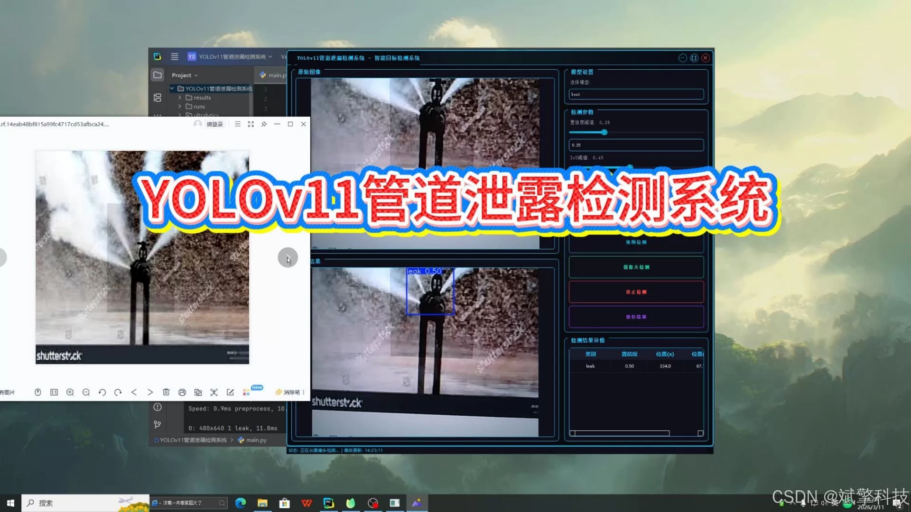
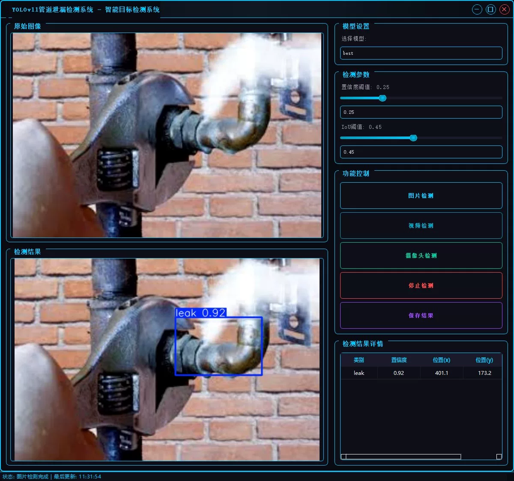
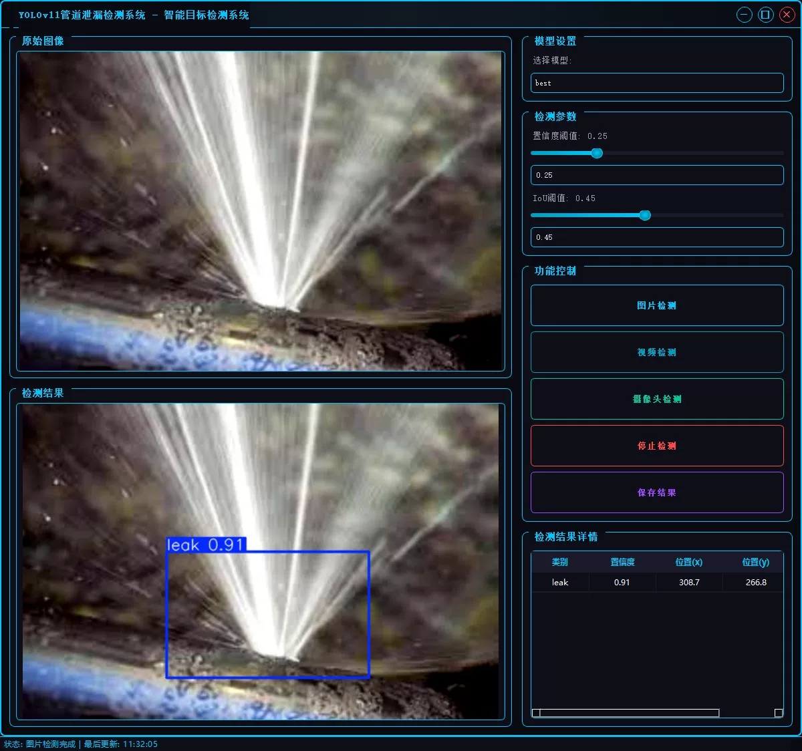
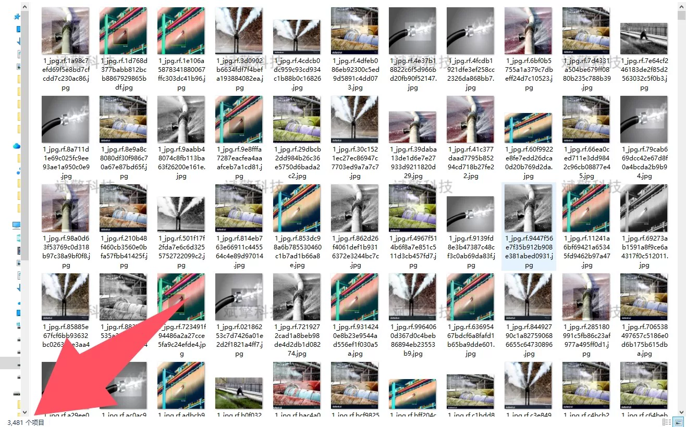
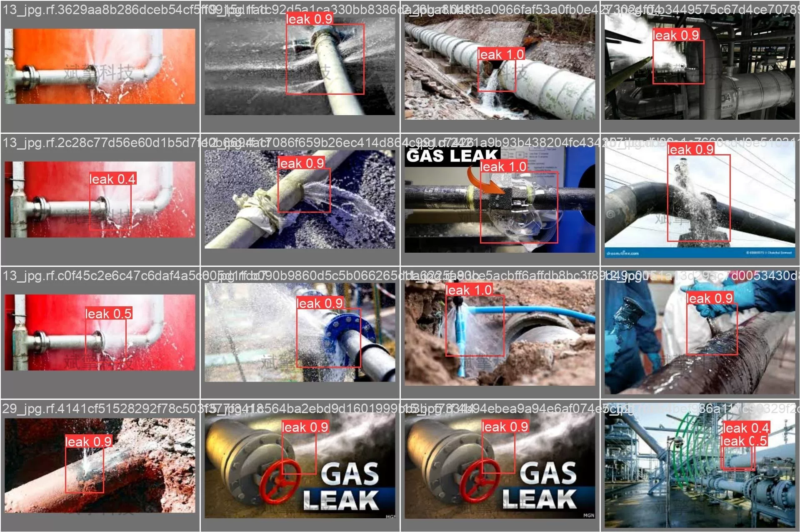

# YOLOv11 pipeline leak detection system

## Body

YOLOv11 Pipeline Leak Detection System, based on the YOLOv11 deep learning target detection algorithm, a smart pipeline leak detection system.

With the widespread application of industrial pipelines, leak accidents not only cause resource waste but may also lead to serious safety incidents and environmental pollution. Traditional pipeline leak detection methods mainly rely on manual patrols or sensor monitoring, which have low efficiency, slow response, and high costs. To solve this problem, this project has developed a set of intelligent pipeline leak detection systems based on the YOLOv11 deep learning target detection algorithm.
The system has three major functional modules: image detection, video detection, and real-time camera detection, which can efficiently and accurately identify pipeline leak points, providing an intelligent solution for industrial pipeline safety monitoring. Through the graphical user interface, users can conveniently upload detection data and view the results in real time, significantly improving the efficiency and accuracy of pipeline leak detection.
The system exhibits excellent accuracy and real-time performance in pipeline leak detection tasks. Moreover, the system is designed with a simple and intuitive interface, supporting image, video, and camera input methods, and can be widely applied in oil, chemical, water supply, and other fields of pipeline leak monitoring, with good practical value and prospects for promotion.

Project Functionality Display

✅ User login registration: Supports password verification and security validation.

✅ Three detection modes: Based on the YOLOv11 model, supports image, video, and real-time camera detection, accurately identifying targets.

✅ Dual screen comparison: Displays the original scene and detection results on the same screen.

✅ Data visualization: Real-time table displaying the category, confidence, and coordinates of detected targets.

✅ Intelligent parameter adjustment: Offers a confidence slide bar to dynamically optimize detection accuracy, adapting to different scene requirements.

✅ Sci-fi style interactive interface: Dark theme combined with dynamic light effects, reducing visual fatigue and enhancing operational experience.

✅ Multi-thread high-performance architecture: Independent detection threads ensure smooth operation, real-time status prompts, and rapid response without lag.

Dataset Introduction

Training set: 3481 images
Validation set: 911 images

## Images

## Payment

Here is a pay link on Stripe ( https://buy.stripe.com/3cs8yP7sY87d0vu9AB ). Please contact me lonlonago@foxmail.com after funding $89, and I will send you a complete data files , thank you!

